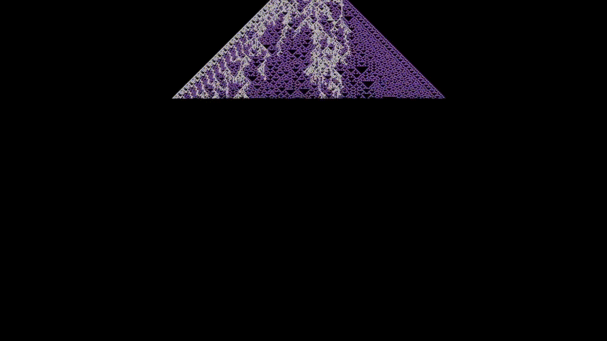
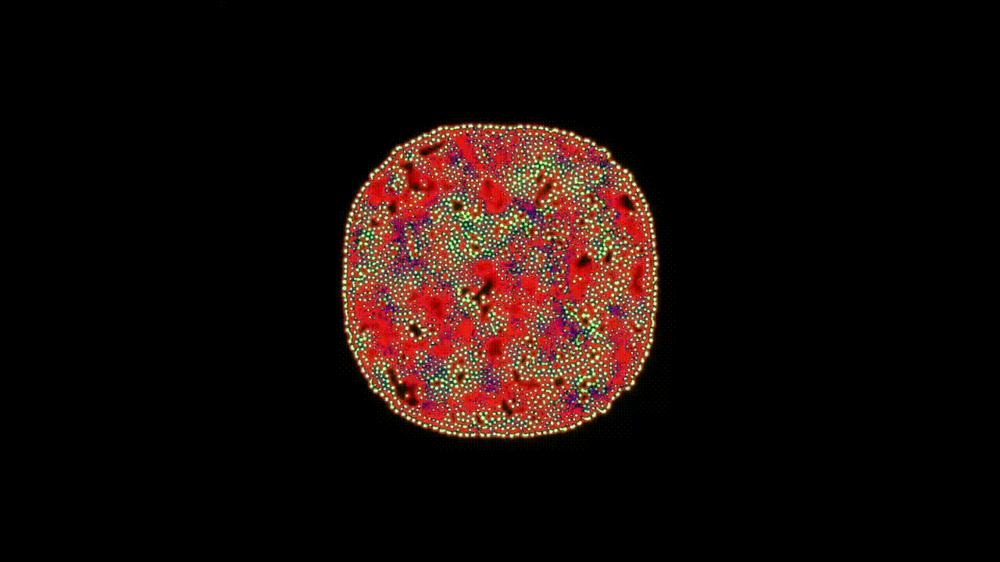
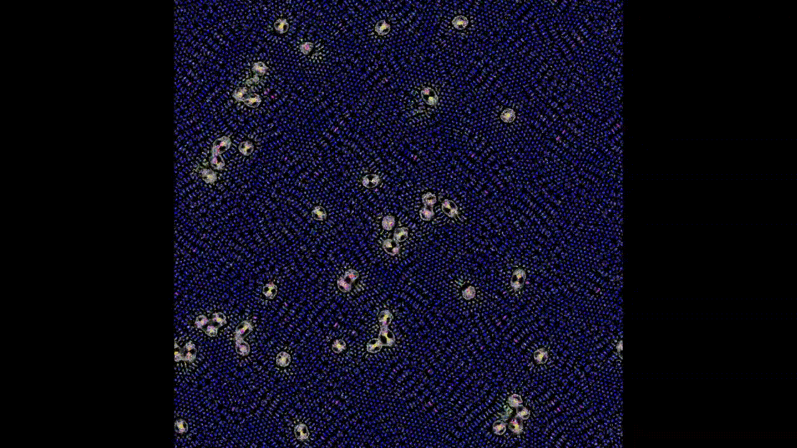
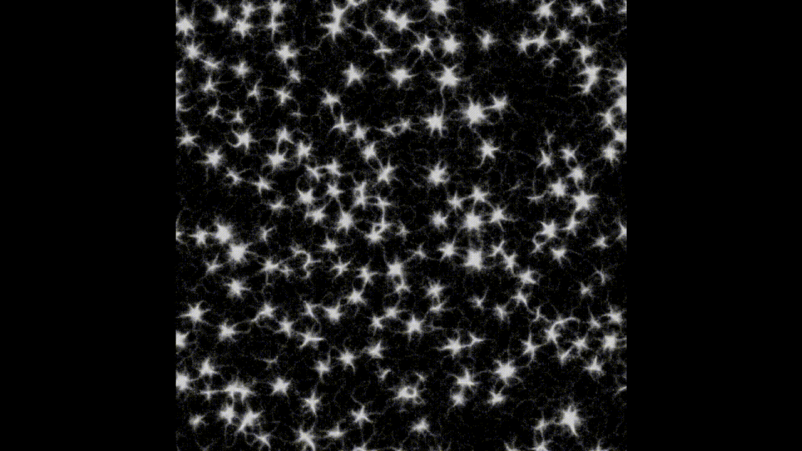

 
  <h1 align="center">Hi, I'm Matheus Freitas!</h1>
  <h4 align="center">💻 Computer Engineer</h4>
  <h4 align="center">Insper • NTT Data</h4>
  <h4 align="center">📍  São Paulo, Brazil</h4>
  <h6 align="center">I am a Computer Engineer. My graduation in Computer Engineering at Insper played a major role in shaping the way I approach engineering problems. It exposed me to a broad range of disciplines, including Computer Graphics, Artificial Intelligence, Machine Learning, Data Science and others.  

Currently, as a Software Engineer at NTT DATA, I worked on the development of immersive XR and Spatial Computing applications, contributing across the full development lifecycle, from technical development to cross-platform deployment. Developed XR applications using Unity and C# for Apple Vision Pro, Meta Quest, Microsoft HoloLens, iOS, and Android platforms.
  </h6>

<!--
**MatFreitas/MatFreitas** is a ✨ _special_ ✨ repository because its `README.md` (this file) appears on your GitHub profile.

* 
-->
<h2>&nbsp;Projects that make me proud</h2>

  
  
  
  

<h2>&nbsp;Shader Simulations</h2>

<table>
  <tr>
    <td align="center" width="50%">
      
       
      <a href="https://youtu.be/hwru1ZJQ9Q0">
        <b>Edge of Chaos</b>
      </a>
       
      Christopher Langton’s 1990 idea of “Computation at the Edge of Chaos”.
    </td>
    <td align="center" width="50%">
      
       
      <a href="https://youtu.be/G8coZ4FEWDw">
        <b>Reaction Diffusion</b>
      </a>
       
      Two chemicals constantly reacting and diffusing through space.
    </td>
  </tr>
  <tr>
    <td align="center" width="50%">
      
       
      <a href="https://youtu.be/Dms5rMC3oGE">
        <b>Multiple Neighborhood Cellular Automata</b>
      </a>
       
      Cellular Automata using multiple neighborhoods, arranged in toroidal shapes.
    </td>
    <td align="center" width="50%">
      
       
      <a href="https://youtu.be/1IHuMnCP4a4">
        <b>Trail of Agents</b>
      </a>
       
      Stigmergy simulation, a behavior similar to how ants or slimes work.
    </td>
  </tr>

</table>

<h2>&nbsp;My GitHub History</h2>

<h2>&nbsp;Some Tools I Have Used and Learned</h2>

  
  
  
  
  
  
  
  
  
  
  
  
  

## Contact me

  

  
  
  

